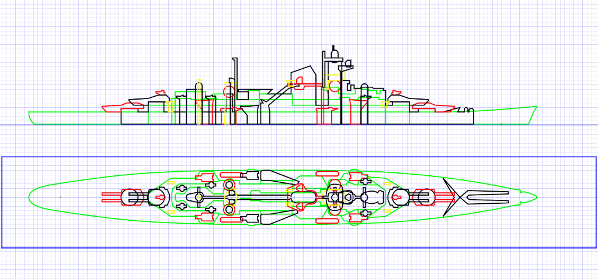
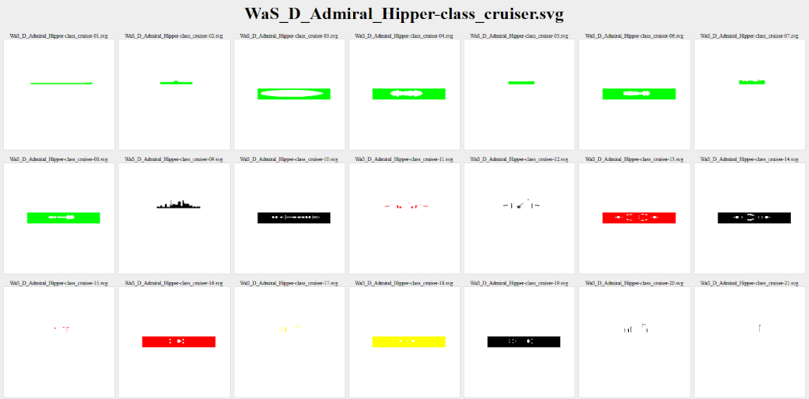
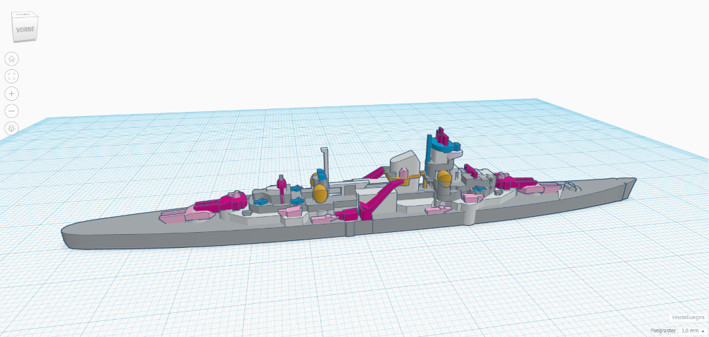

# SVG Splitter

Split a single SVG file into multiple SVG files, each file containing one single SVG element.

This can be used to produce importable files for [Tinkercad](https://www.tinkercad.com/).

## Installation

Requirements:

- [Node.js](https://nodejs.org/en/) (Version 16+) - this will also install `npm`
- Optional: [Windows Terminal](https://apps.microsoft.com/store/detail/windows-terminal/9N0DX20HK701) or use your pre-installed terminal

Run `node -v` (or `nodejs -v`) in your terminal to check if you meet the preconditions. The installation of this tool is straightforward:

```bash
npm install global fboes/svg-split
```

Check if `svg-split` has installed successfully by starting the programme:

```bash
svg-split
```


## Usage

You will need to draw a SVG file first. For Inkscape it is best to make all object coordinates absolute by selecting all paths in your SVG (<key>Ctrl</kbd> + <kbd>A</kbd>) and using  "Object > Transform", de-select "Relative Mode" and select "Apply to each" before hitting "Apply". 



Being a command line tool, you will need to open a terminal every time you want to use `svg-split`:

```bash
svg-split YOUR_SVG_FILE.svg
```

This will split up the SVG file into multiple SVG files, and put these into your current directory. It will also generate an `index.html` which allows you to check all SVG files that have been generated.

If the number of objects in your SVG file is odd, and there is a single rectangle present, this rectangle will be used to make an inverse SVG of the SVG paths it encloses. This can be used to build [cookie cutters](https://www.tinkercad.com/blog/tinkertip-hole-vs.-transparent).



These SVG files can be imported into [Tinkercad](https://www.tinkercad.com/) - or used in any other way you can think of.



## Legal stuff

Author: [Frank Boës](https://3960.org)

Copyright & license: See [LICENSE.txt](LICENSE.txt)

As stated in the [LICENSE.txt](LICENSE.txt), this tool comes with no warranty and might damage your files.

This software complies with the General Data Protection Regulation (GDPR) as it does not collect nor transmits any personal data to third parties.
